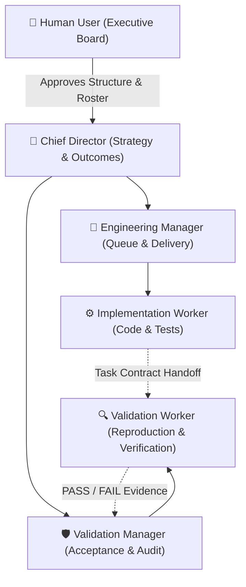

# Agent Swarm

**Build structured, accountable AI agent teams with organizational hierarchies, capability matching, and evidence-backed governance.**

Created by [shiverin](https://github.com/shiverin).


---

## Why Agent Swarm?

When multi-agent systems fail, it is almost never because the underlying LLMs lack raw intelligence—it is because they lack **structure**.

Most multi-agent frameworks default to flat chat rooms, circular peer-to-peer messaging, or unconstrained autonomous loops. In practice, these setups break down quickly:
- **Context Bloat & Token Waste**: When every agent sees every message, context windows saturate with conversational chit-chat, burning tokens and diluting instructions.
- **Circular Hallucination & Sycophancy**: Agents frequently validate and praise each other's incomplete or broken work, mistaking polite conversational agreement for technical correctness.
- **Scope Creep & File Collisions**: Without rigid boundaries, agents wander outside their objectives, overwrite each other's code, or tackle problems they lack the tools to solve.
- **Lack of Ownership**: When everyone is broadly responsible, nobody is accountable when edge cases fail or deliverables stall.

**Agent Swarm solves this by structuring AI agents like high-performance engineering organizations.** Instead of a chaotic group chat, your agents operate in a disciplined hierarchy with explicit reporting chains, capability-matched roles, isolated validation lanes, and verifiable task contracts.

---

## What Efficiencies Can You Achieve?

| Efficiency Area | What Happens Without Agent Swarm | What You Achieve With Agent Swarm |
| :--- | :--- | :--- |
| **Token & Context Economy** | Monolithic prompt histories balloon across all agents | Agents receive only their role mandate and bounded task inputs, reducing token consumption by up to 70%. |
| **Objective Quality Control** | Agents "rubber-stamp" each other's code without verification | Independent validation lanes test deliverables against observable criteria before management accepts work. |
| **Zero Scope Creep** | Agents touch random files and exceed intended boundaries | Strict task contracts specify exact read inputs, owned write paths, and budget caps before execution begins. |
| **Optimal Skill Matching** | Generalist agents fumble specialized technical tasks | Deterministic capability matching pairs roles with agents that possess the exact required toolsets. |
| **Dynamic Team Evolution** | Static agent setups that break when project scope changes | Swarms scale smoothly—from a 2-agent lean pod to multi-department divisions—with formal promotion and demotion cycles. |
| **Human Executive Control** | All-or-nothing autonomy (micromanage every step or pray nothing breaks) | You remain the executive board: agents recommend structural adjustments, but changes require your cryptographic approval. |

---

## Technical Architecture & Deep Dive

Agent Swarm is built from the ground up as a **pure standard-library, zero-dependency Python toolchain (Python 3.11–3.14)** that runs completely offline in your local environment.



### 1. Concurrency & Atomic State Engine
- **POSIX Advisory File Locks**: All mutating operations (`plan`, `compile`, `review`, `apply`) acquire exclusive POSIX advisory file locks (`fcntl.flock`) on the specification, preventing race conditions across cooperating orchestrators.
- **Staged Atomic Replacement**: Mutations write first to isolated temporary files in the same directory before executing an atomic `os.replace`. Partial writes, broken states, and file corruption during mid-execution interrupts are mathematically impossible.
- **Immutable Snapshots**: Compilations produce completely self-contained, point-in-time snapshot directories (`snapshot/`) with full SHA-256 manifests. Once compiled, snapshots are strictly read-only.

### 2. Cryptographic Integrity & Dual Fingerprinting
Agent Swarm separates mutable history from operating agreements using dual-layer SHA-256 fingerprinting:
- **Full-State Fingerprint**: A hash of the entire specification, including complete audit trails, past performance reviews, and historical events. Used to bind structural change proposals.
- **Operating-Roster Fingerprint**: A hash strictly of the active operating contract (project brief, active roles, current assignees, and governance policies), excluding historical reviews. This allows multiple team reviews to be recorded in parallel without rendering unsubmitted forms stale.
- **Exact-Hash Decision Digest**: Before any mutation is applied, `swarm.py digest` prints a SHA-256 hash of the exact proposal JSON. The user's decision file must match this digest character-for-character to be accepted.

### 3. 360-Degree Mathematical Evaluation Engine
Performance assessments use a multi-reviewer mathematical model:
- **Score Dimensions**: Evaluates agents across four 1–5 integer dimensions: `quality`, `reliability`, `collaboration`, and `initiative`.
- **Weighted Consensus**:
  $$\text{Cycle Score} = (\text{Formal Supervisor Review} \times 0.70) + (\text{Peer / Upward Reviews} \times 0.30)$$
  *(If peer/upward feedback is absent, formal supervisory review carries $100\%$. If formal review is missing, the cycle is marked INCONCLUSIVE.)*
- **Actionable Thresholds**:
  - **Promotion ($\ge 4.2$)**: Recommends advancement to higher tiers, conditional on target role vacancy and verified capability matching.
  - **Coaching / Demotion ($\le 2.5$)**: Flags underperforming agents for formal improvement plans or demotion.
  - Requires at least two formally completed cycles before triggering structural recommendations.

### 4. DAG Hierarchy & Tree Validation
The specification validator enforces strict organizational invariants:
- **Single Root**: Exactly one Chief Director reports directly to the user.
- **Strict Tree Hierarchy**: Cycle detection prevents circular reporting lines.
- **Leaf-Node Enforcement**: Workers are strictly execution units and cannot have direct reports.
- **Zero Orphaned Roles**: Removing or reparenting roles requires explicit leaf status or cascading reassignments.

### 5. Zero-Dependency Vector Visualizer
Generates standalone, publication-grade SVG org charts and Mermaid diagrams directly through Python standard library string synthesis—no Node.js, Graphviz, or headless browsers required. Features responsive typography, color-coded workstream badges, glowing reporting paths, and visual vacancy indicators.

---

## Quick Start Guide

### 1. Installation

Clone directly into your project workspace:

```bash
git clone https://github.com/shiverin/agent-swarm.git
cd agent-swarm
```

Or install as a local skill for AI coding assistants:

```bash
git clone https://github.com/shiverin/agent-swarm.git "${CODEX_HOME:-$HOME/.codex}/skills/agent-swarm"
```

### 2. Generate a Team from a Project Brief

Create an initial organizational structure deterministically from a project brief:

```bash
# Generate a lean 3-role starter team
python3 scripts/swarm.py compile --spec assets/example-lean-org.json --out ./build/team-v1
python3 scripts/swarm.py verify --snapshot ./build/team-v1
```

Open `build/team-v1/orgchart.svg` to view the visual hierarchy. Every role starts **VACANT** and includes generated `system.txt`, `goal.txt`, and `role.json` persona files ready for deployment.

For larger engineering organizations with directors, managers, and specialized workers:

```bash
python3 scripts/swarm.py plan --brief assets/example-brief.json --out ./build/company-v1
```

### 3. Staff Open Roles with Capability Matching

Match available agent identities to vacant roles based on their declared toolsets:

```bash
# Create your active mutable spec
mkdir -p ./team
cp ./build/team-v1/org.json ./team/org.json

# Check which roles best fit your agent
python3 scripts/swarm.py match --spec ./team/org.json --agent builder
```

### 4. User-Approved Staffing & Cryptographic Digest

Staffing and structural changes require explicit user governance:

1. Prepare a proposal in `team/proposal.json` (assigning agents to roles).
2. Calculate the exact proposal digest:
   ```bash
   python3 scripts/swarm.py digest --input ./team/proposal.json
   ```
3. Populate `team/decision.json` with your approval, rationale, and matching `proposal_sha256`:
   ```json
   {
     "actor": "user",
     "approved": true,
     "proposal_id": "staffing-001",
     "proposal_sha256": "<SHA-256 DIGEST FROM PREVIOUS STEP>",
     "rationale": "Staffed builder and checker into implementation and validation roles."
   }
   ```
4. Apply the proposal and compile the staffed team:
   ```bash
   python3 scripts/swarm.py apply --spec ./team/org.json --proposal ./team/proposal.json --decision ./team/decision.json
   python3 scripts/swarm.py compile --spec ./team/org.json --out ./build/team-v2
   ```

### 5. Dispatch Bounded Tasks & Record 360° Reviews

Run work using explicit [task handoff contracts](references/design.md#pipeline-and-acceptance) between workers and validators. After each cycle, record performance reviews:

```bash
# Record an evidence-backed review
python3 scripts/swarm.py review --spec ./team/org.json --input assets/example-review.json

# Assess performance recommendations
python3 scripts/swarm.py assess --spec ./team/org.json --agent builder
```

---

## CLI Command Cheat Sheet

| Command | Description | Common Use Case |
| :--- | :--- | :--- |
| `plan --brief <PATH> --out <DIR>` | Generates an unstaffed starter organization | Starting a new project from a high-level brief |
| `compile --spec <PATH> --out <DIR>` | Compiles an immutable snapshot with prompts & SVGs | Publishing a new operational version of the swarm |
| `validate --spec <PATH>` | Verifies hierarchy, DAG validity, and audit history | Pre-flight validation before applying changes |
| `verify --snapshot <DIR>` | Verifies inventory, file hashes, and manifest | Ensuring snapshot files have not been tampered with |
| `match --spec <PATH> --agent <ID>` | Recommends vacant roles matching an agent's skills | Finding optimal role placement for a new agent |
| `review --spec <PATH> --input <PATH>` | Records an attributable 360° performance review | Logging supervisor or peer evaluations after a milestone |
| `assess --spec <PATH> --agent <ID>` | Computes promotion/demotion recommendations | Deciding whether an agent is ready for promotion |
| `fingerprint --spec <PATH> [--roster]` | Prints full-state or operating-roster SHA-256 hash | Verifying state synchronization before tasks |
| `digest --input <PATH>` | Computes SHA-256 hash of a change proposal | Generating the hash required for user approval |
| `apply --spec <PATH> --proposal … --decision …` | Applies an approved change under atomic file lock | Reorganizing teams, promotions, or reassignments |

---

## Security & Operational Boundaries

- **Host Enforced**: Agent Swarm manages organization structure, prompts, and governance. Your runtime host enforces filesystem sandboxing, network policies, API keys, and process execution.
- **No Implicit Privileges**: An agent's title, promotion, or org-chart edge never grants external permissions or access tokens. Tool access is strictly governed by explicit project allowlists.
- **Untrusted Metadata**: Review scores and self-reported evidence are treated as untrusted metadata. Independent validation roles and human inspection ensure integrity before executive decisions are executed.
- See [readiness and validation](docs/READINESS.md) for tested behavior and deployment requirements.

---

## Documentation Index

- [Skill Definition](SKILL.md): Complete instructions for AI coding assistants using this skill.
- [Organization Design](references/design.md): Topologies (lean, functional, pods, task forces) and task handoff contracts.
- [Governance & Reviews](references/governance.md): Review formulas, promotion/demotion criteria, and approval rules.
- [Pipeline & Commands](references/pipeline.md): Comprehensive CLI reference and schema definitions.
- [Design Foundations](references/origins.md): Architectural origins and multi-agent coordination principles.

---

## Testing & Verification

Run the full offline verification suite:

```bash
python3 scripts/check_release.py
```

This verifies:
- 20 unit tests covering concurrency locking, transactional rollback, and governance.
- 100% valid internal Markdown documentation links.
- Well-formed SVG XML generation.
- Deterministic multi-topology plan compilation and synthetic staffing.
