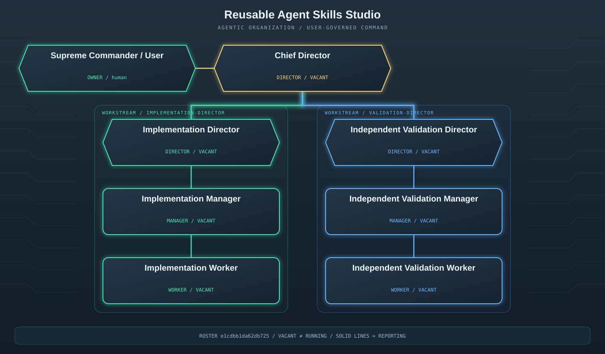

# Agent Swarm

**Agent organizations with clear roles, useful skills, and evidence behind “done.”**

A reusable skill and offline pipeline for project-specific org charts, capability-based staffing, persona prompts, performance reviews, and user-decided promotions, demotions and reorganizations. Created by [shiverin](https://github.com/shiverin), generalized from their WorldQuant and solo-quant workflows.



Generated diagrams use the neon enterprise infographic style of the original quant workflows: hexagonal executive cards, color-coded workstream panels, circuit details and glowing reporting lines. Charts remain deterministic SVGs generated from the actual roster.

## Supported scope

This release supports an **offline organization compiler and governance workflow in a trusted local workspace**. It does not start agents. Your host enforces identity, tools, filesystem scopes, task ownership, runtime budgets and external-action authorization. A JSON field saying `actor: "user"` is an audit record, not authentication. See [readiness and validation](docs/READINESS.md) for tested behavior and deployment requirements.

Requirements: Python **3.11–3.14**, macOS or Linux, and a local filesystem supporting POSIX locks and atomic replacement. No API key, model account or third-party Python package is needed. Shared/network filesystems and untrusted multi-tenant deployments are outside the supported scope.

Input files are limited to 8 MiB. Duplicate JSON keys, non-finite numbers and XML-invalid text are rejected. Fingerprints check consistency; they are not signatures or a defense against someone who can rewrite both files and hashes.

## Install

Clone for standalone use:

```bash
git clone https://github.com/shiverin/agent-swarm.git
cd agent-swarm
```

For Codex, clone into an unused skill directory instead:

```bash
git clone https://github.com/shiverin/agent-swarm.git "${CODEX_HOME:-$HOME/.codex}/skills/agent-swarm"
```

The destination must not already contain an installation. Inspect local changes before updating an existing installation. Other agent hosts can load [SKILL.md](SKILL.md) and its linked references; universal host integration is not claimed.

Example request:

> Use $agent-swarm to design a team for my project. Propose a minimal org chart, match available agents, generate system and goal prompts, and prepare a review policy for my approval.

## Quick start

From the repository directory, generate the lean example:

```bash
python3 scripts/swarm.py compile --spec assets/example-lean-org.json --out ./build/team-v1
python3 scripts/swarm.py verify --snapshot ./build/team-v1
```

Open `build/team-v1/orgchart.svg`. All roles start **VACANT**; registry entries are example identities, not launched workers. Every role gets `system.txt`, `goal.txt` and `role.json` under `personas/<role-id>/`. Goal prompts are activation templates: fill actual task inputs, outputs, reserved budget and acceptance checks before execution.

For a larger director → manager → worker organization:

```bash
python3 scripts/swarm.py plan --brief assets/example-brief.json --out ./build/company-v1
```

The planner is deterministic. Customize the brief and adapt the proposed structure to actual work dependencies and available agents; it does not infer runtime capacity or call an LLM.

## Staffing walkthrough

Keep canonical mutable state separate from immutable snapshots:

```bash
mkdir -p ./team
cp ./build/team-v1/org.json ./team/org.json
python3 scripts/swarm.py match --spec ./team/org.json --agent builder
cp assets/example-staffing-proposal.json ./team/proposal.json
cp assets/example-staffing-decision.json ./team/decision.json
python3 scripts/swarm.py digest --input ./team/proposal.json
```

The example proposal fits the unchanged lean organization: `lead` becomes chief director, `builder` fills implementation, and `checker` fills validation. For your project, register actual available agents, use the generated proposal form, set its current full-state fingerprint, and replace example evidence and costs with real information.

**After the human approves the exact proposal**, they or their authorized controller set `approved: true` and provide a rationale in `team/decision.json`. Check that `proposal_sha256` matches the printed digest. The supplied decision deliberately starts with `approved: false`.

```bash
python3 scripts/swarm.py apply --spec ./team/org.json --proposal ./team/proposal.json --decision ./team/decision.json
python3 scripts/swarm.py compile --spec ./team/org.json --out ./build/team-v2
python3 scripts/swarm.py verify --snapshot ./build/team-v2
```

Continue future mutations against `team/org.json`. Preserve generated snapshots; modifying a snapshot's `org.json` makes its manifest fail verification. Matching is a recommendation, not assignment; capabilities are host-supplied metadata, not proof of competence.

## Bounded execution

1. A supervisor or the user creates a [task contract](references/design.md#pipeline-and-acceptance) with one owner, inputs, outputs, dependencies, acceptance, reviewer and centrally reserved budget.
2. The host supplies the assigned role's system prompt and completed goal prompt to a real agent. Verify the current roster fingerprint and assignment before dispatch.
3. Directors coordinate outcomes; managers own queues and acceptance; workers produce scoped artifacts. Lean teams can report directly to the director.
4. Independently check outputs. Return PASS, FAIL or INCONCLUSIVE with evidence. Count retries against the same total budget; stop on missing resources, ownership conflicts or exhaustion.
5. At the checkpoint, hand off artifacts and terminate or explicitly transfer owned workers. Finish the cycle rather than inventing work to keep the swarm busy.

The pipeline records organization and governance. The host must implement task reservations, actual spend enforcement and runtime lifecycle.

## Reviews and personnel decisions

Fill a generated per-role review form: globally unique `id`, cycle, allowed reviewer, all four 1–5 scores, evidence, strengths, concerns and an improvement plan. Use a new ID for every additional reviewer or cycle. An unassigned supervisor appears as null; staff that supervisor or obtain a user review.

```bash
python3 scripts/swarm.py review --spec ./team/org.json --input ./team/review-builder-cycle-001.json
python3 scripts/swarm.py assess --spec ./team/org.json --agent builder
```

Reviewers may be the user, immediate supervisor, a peer with the same reporting parent, or a direct report. Self-reviews and unrelated reviewers are rejected. The user formally reviews the highest director.

Default recommendations require two formally reviewed cycles: promotion at ≥4.2; improvement or demotion at ≤2.5. Formal reviews weigh 70% and peer/upward feedback 30%; without feedback, formal reviews weigh 100%. The user sets policy and can override recommendations with an explained decision.

Promotions and demotions require an exact-hash user-approved proposal and relevant recorded reviews. Reviews bind the current appointment and role contract: returning to a previous role does not revive old scores. Reparenting that changes rank—including affected descendants—also needs reviews. Lateral moves followed by reparenting cannot bypass this requirement.

Use [governance](references/governance.md) for coaching and decisions, and [pipeline commands](references/pipeline.md) for movement syntax. Arrange task handoffs before applying changes; the script does not terminate active runtimes.

## Invent and mutate the organization

Choose a lean hierarchy, functional departments, product pods, temporary task force or independent-validation hub according to outputs and measured bottlenecks. Proposals include the current full-state fingerprint, problem evidence, alternatives, expected benefit, cost, risks, rollback and exact operations.

Useful mutations: split a blocked workstream; merge overlapping mandates; add independent validation; incubate a bounded experimental department; retire a temporary group when its mission closes. Adding management should solve a coordination problem. The user selects the design. See [organization design](references/design.md).

## Commands

| Command | Purpose |
| --- | --- |
| `plan --brief … --out …` | Generate an unstaffed starter design |
| `compile --spec … --out …` | Generate a new chart/prompt snapshot |
| `validate --spec …` | Check hierarchy, staffing, reviews and audit consistency |
| `verify --snapshot …` | Verify snapshot inventory, specification and hashes |
| `match --spec … --agent …` | Recommend vacant roles |
| `review --spec … --input …` | Record attributable feedback |
| `assess --spec … --agent …` | Recommend an outcome without applying it |
| `fingerprint --spec … [--roster]` | Print full-state or operating-roster hash |
| `digest --input …` | Hash the exact proposal being approved |
| `apply --spec … --proposal … --decision …` | Apply a user-approved change |

Snapshots contain SVG/Mermaid diagrams, role personas, staffing recommendations, review/proposal/decision forms and a manifest. New output paths are required. Cooperating writers use advisory locks and fail fast on conflicts. State writes use staged atomic replacement. Exit codes: 0 success, 1 rejected input or operational failure, 2 argument error. Locks are local coordination, not access control or a crash-recovery service.

## Tests and maintenance

```bash
python3 scripts/check_release.py
```

This runs 20 behavioral tests, documentation-link checks, SVG checks, fresh designs and synthetic example staffing. CI runs behavioral tests and fresh generation/verification on Python 3.11–3.14 across Ubuntu and macOS, with read-only permissions and commit-pinned Actions. [Readiness](docs/READINESS.md) separates local evidence from remote CI; configured checks are not claimed as completed checks.

Keep approval files outside untrusted agent write scopes. Inspect referenced evidence. Back up canonical state and historical snapshots together. When a snapshot fails verification, compare it with canonical state and compile a new snapshot rather than silently rewriting its manifest.

## Provenance and reuse

[Origins](references/origins.md) describes the generalized design. No private research ledger, credentials, proprietary financial expressions or live execution adapter is bundled. This package does not run or modify the source finance repositories.

No license has been selected. This repository currently includes no LICENSE file; contact the author to arrange reuse.
